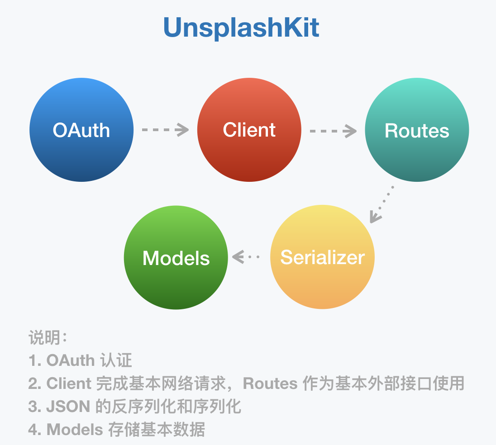

# TykiesUnsplash

TykiesUnsplash 是对[Unsplash API](https://unsplash.com/developers) 的接口封装。




## **Background：**

本 Repo 想法来源于[UnsplashSwift](https://github.com/camdenfullmer/unsplash-swift) ，项目停止维护了，故此拿来进行 Swift 4.0的适配和其他修改。
TykiesUnsplash 使用[Alamofire](https://github.com/Alamofire/Alamofire) 和 OAuth 身份验证作为基本的网络交互。 整体项目框架是基于 Dropbox 的 Swift 版本 [SwiftyDropbox](https://github.com/dropbox/SwiftyDropbox)的基本框架思路来实现的。


 
## Features

想要获取某一个数据，然后接口就回调输出相对应的 Model，而不用做其他的操作。

当前只疏通了基本流程和一个 Photos 接口的输出。

- User Authorization
- Photos

## Requirements

- iOS 9.0+
- Xcode 9.3
- Swift 4.0

##Usage
### Set Up

先从 [Unsplash API](https://unsplash.com/developers) 注册一个应用，拿到Access key和 secret key,并注意你填的`Redirect URI`

UnsplashOAuthManager.swift

```
public init(access: String, secret: String, scopes: [String]=UnsplashOAuthManager.publicScope) {
        self.access = access
        self.secret = secret
        self.redirectURL = URL(string: "http://demo.com")!
        self.scopes = scopes
    }
```

Appdelegate.swift

```
func application(_ application: UIApplication, didFinishLaunchingWithOptions launchOptions: [UIApplicationLaunchOptionsKey: Any]?) -> Bool {
        // Override point for customization after application launch.
    Unsplash.setUpWithAccess("Access key",
                                secret: "secret key",
                                scopes: UnsplashOAuthManager.allScopes)
        
        return true
    }
```
### Photos

#### List Photos

```swift
let client = Unsplash.client!
client.photos.findPhotos(2, perPage:nil).response({ response, error in
    if let result = response {
        print(result.photos)
    } else {
      // Handle error.
    }
})
```

# To Do
* [x] 基本 Demo 测试，输出接口
* [ ] JSON 解析优化，待完善
* [ ] 继续完善基础框架
* [ ] 整理并输出文档
* [ ] 单元测试


# Document 

* OAuth 2.0 认证管理
* JSON 序列化
* 是不是可以引入 Rxswift 


## License

TykiesUnsplash is released under the MIT license. See LICENSE for details.


